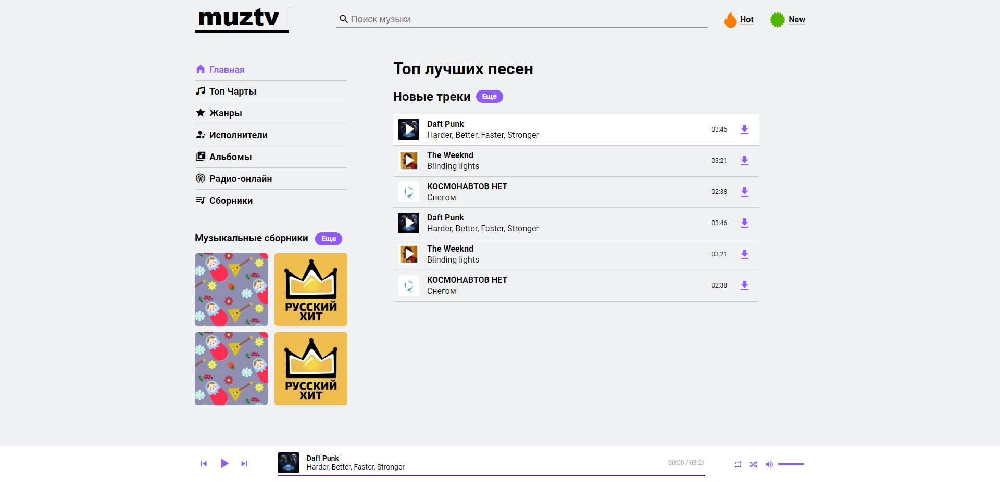

# MUZTV

Тестовое задание для компании Maximal



### Приложение доступно для просмотра по [ссылке](https://besovmusic.github.io/Maximal-test/app/)

---

## Используемые технологии

-   HTML
-   SCSS
-   JS
-   Webpack

### Установка зависимостей

```
npm install
```

### Компиляция и hot-reloads для разработки

```
npm run serve
```

### Сборка и минификация файлов для продакшена

```
npm run build
```

### Сборка файлов для разработки

```
npm run dev
```
